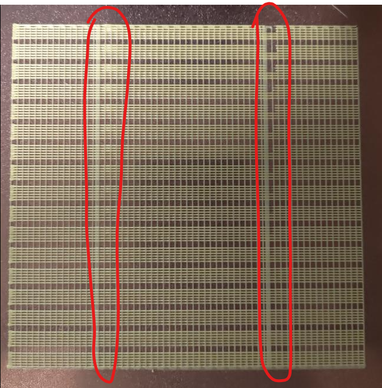
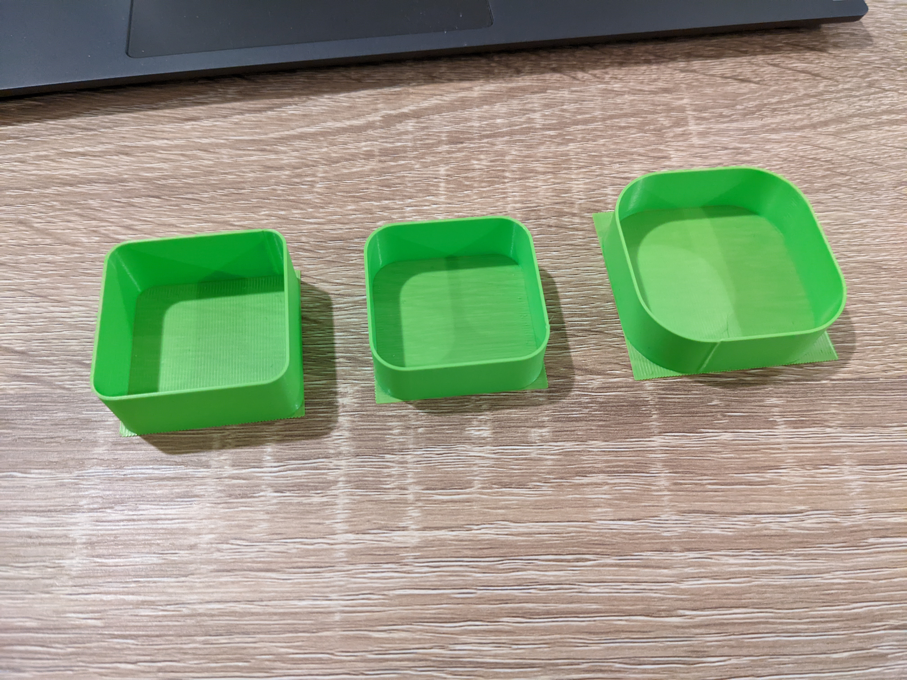

# Detailed features description

This config is designed to be generic. You can use it on a lot of machines by selecting and enabling the hardware options you need. This also activate automatically the associated macros and process under the hood.

## Hardware features

This config support out of the box a lot of different machine hardware configurations.
More info will be added in this section later...

## Software features

I tried, when possible, to put all the print settings directly in the Klipper config. My utlimate goal is be to be able to use the same Gcode file (sliced generically) with multiple materials or even share it across multiple printers. That's why I use and set firmware retraction, set pressure advance in the macros, etc...

Here you can find a list of all the custom features availables in the macros or in the software configuration of this Klipper config.

### Adaptive bed mesh

The adaptive bed mesh is one of the most known macro of this config. It's almost like a normal bed mesh, but only "where" and "when" it's necessary.

Sometime I print small parts, sometime I print full plates and I like to get a precise bed_mesh (like 9x9 or more). However, it take a lot of time and it's useless to probe all the plate for only a small part in the middle. This is where the adaptive bed mesh is helping.

Here is how the magic happen:
  1. The coordinates of the first layer corners are extracted from the slicer (currently work with SuperSlicer, PrusaSlicer and Cura)
  2. On this area, a new set of points is computed to get at least the same precision (or better) as the original `[bed_mesh]` section. For example, if the `[bed_mesh]` section is set to 9×9 for a 300mm² bed, then it will compute for a 100mm² first layer surface a 3×3 mesh. Also if for whatever reason your parts are not in the center of the build plate (like when using a damaged PEI center), it will follow them to probe this exact area.
  3. The computed set of probed points is always odd: this allow the algorithm to compute a `relative_reference_index` point exactly in the center of the area. This point coordinates are saved in a variable if you need to use it somewhere else (like for example with the [klipper_z_calibration](https://github.com/protoloft/klipper_z_calibration) plugin and its `BED_POSITION` parameter).
  4. To go further, the adaptive bed mesh macro has also some smart features:
     - The shape of the computed mesh is not always a square and is always adapted to fit the first layer: for example, it can be something like 3×9 in case of an elongated part.
     - In case of a very small part, the algorithm can choose automatically to not do any bed mesh at all if there is less than 3×3 points to probe.
     - The macro can also choose and change automatically the interpolation algorithm between bicubic and lagrange depending of the size and shape of the mesh computed (like 3×3 vs 3×9) to always get the best precision.
     
### Calibration macros

To allow an easier calibration of the printer, I've integrated a set of calibration macros in this config. Here is a description of what each of them can do.

###### Pressure advance calibration
The standard way of calibrating the PA is quite ambigous, open to interpretation with a broad margin for error, and use each time a good amount of filament. This macro provide a quick and easy way to calibrate the pressure advance where differences are easier to notice at a glance.

This macro print a series of ¨bands¨, each containing 6 lines, with the first 3 lines printed slowly and used as baseline/control and the other 3 with variable speeds in the following sequence: 25% of the line at low speed, then 50% at high speed, and the last 25% at low speed again. Then, the pressure advance value is being increased for every band.

The printed model can then be inspected by looking at the top and bottom lines in each band: pressure advance artefacts can be seen where the print speeds change on every line. You just need to find the highest band from the bottom, where the lines at its top still look similar to the lines at its bottom, with no visible extrusion width irregularities or pressure advance artifacts.

###### Flow calibration
A lot of different method exist to measure and calibrate the flow but none of them is really consistent: most of the time, the results are ambigous and open to interpretation and also always dependant of the slicer profile used. The main reason for this calibration macro is to get a filament and slicer agnostic way to calibrate the flow extrusion multiplier using simple measuring tools. The goal is to make it easy to set, share and use it.

This macro is parametric and most of the values can be adjusted with their respective input parameters. It's working in two phases:
  1. First, you call the `FLOW_MULTIPLIER_CALIBRATION` macro to print an hollow shell with a known number of perimeters based on the [Slic3rPE flow math](https://manual.slic3r.org/advanced/flow-math). The macro also print in the Fluidd/Mainsail console the theorical shell thickness that you should measure.
  2. Then, when the print end, you need to measure the shell average thickness using a micrometer (a good caliper is also ok, but use a minimum of two perimeters) and input it in the second macro `COMPUTE_FLOW_MULTIPLIER MEASURED_THICKNESS=xxx.xxx`. The new calibrated flow is automatically printed in the Fluidd/Mainsail console.

###### Input shaper workflow
This set of two macros (and associated bash script) is to help you configure the input shaper algorithm of Klipper. It's a full automated workflow that:
  1. Run the tests either for the two axis or the two belts to measure the machine behavior using the ADXL345. This is in fact, under the hood, a call to the Klipper `TEST_RESONANCES` command with the different parameters needed for each axis.
  2. Then, it call an automatic bash script that automate a few things:
     1. it generate the graphs.
     2. it then move the graphs and associated csv to the [ADXL results folder](./../adxl_results/).
     3. it manage the files to delete the older one and keep only a set (default is three) of the most recent results.

Results can be found in the [ADXL results folder](./../adxl_results/) that is placed directly at the root of the config folder to allow the access directly from your browser using the FLuidd/Maisail file manager. No more SSH is needed to calibrate your input shaper !

###### Vibrations measurements
This macro helps you to identify the speed settings that exacerbate the vibrations of the machine (ie. where the frame resonate badly).
It also helps to find the clean speed ranges where the machine is silent.
I had some strong vibrations at very specific speeds on my machine (52mm/s for example) and I wanted to find all these problematic speeds
to avoid them in my slicer profile and finally get the silent machine I was dreaming!

It works by moving the toolhead at different speed settings while recording the vibrations using the ADXL chip. Then the macro call a custom script
to compute and find the best speed settings. The results can be found in your config folder using Fluidd/Mainsail file manager.

### Other macros and features

This config support a lot of other features. More info will be added in this section later...
